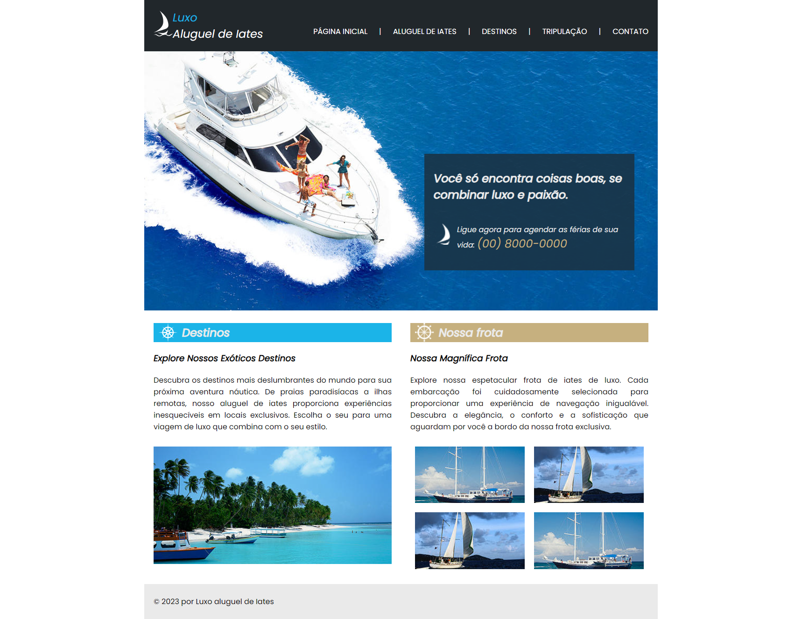

 

<h1 align="center"> Aluguel de Iates </h1>

Este repositório foi criado para armazenar a resolução do Trabalho Efetivo Discente (TED) da matéria de Tecnologias WEB I, ministrada pelo Professor Gláucio Rocha, do curso de Análise e Desenvolvimento de Sistemas do UNIESP Centro Universitário. 

 

  <a href="#-tecnologias">🚀 Tecnologias</a>&nbsp;&nbsp;&nbsp;|&nbsp;&nbsp;&nbsp;
  <a href="#-desafio">🎯 Desafio</a>&nbsp;&nbsp;&nbsp;|&nbsp;&nbsp;&nbsp;
  <a href="#-layout">🔖 Layout</a>&nbsp;&nbsp;&nbsp;|&nbsp;&nbsp;&nbsp;
  <a href="#memo-licença">:memo: Licença</a>

 

  

## 🚀 Tecnologias

Este projeto foi desenvolvido com as seguintes tecnologias:

 

## 🎯 Desafio

O aluno deve desenvolver interface web (HTML e CSS) do site modelo em anexo, apenas a primeira página, aplicando o conhecimento aprendido na disciplina. O projeto deve ser o mais fidedigno possível do layout do projeto.

Na pasta "Orientações" encontram-se as imagens que o aluno precisará no decorrer do desenvolvimento do layout.

 

## 🔖 Layout

Você pode acessar o site através [DESTE LINK](https://thiagomonts.github.io/yacht_rental/).

 

## :memo: Licença

Esse projeto está sob a licença MIT.

---

Desenvolvido por [Thiago Honorato](https://www.linkedin.com/in/honoratothiago/)
